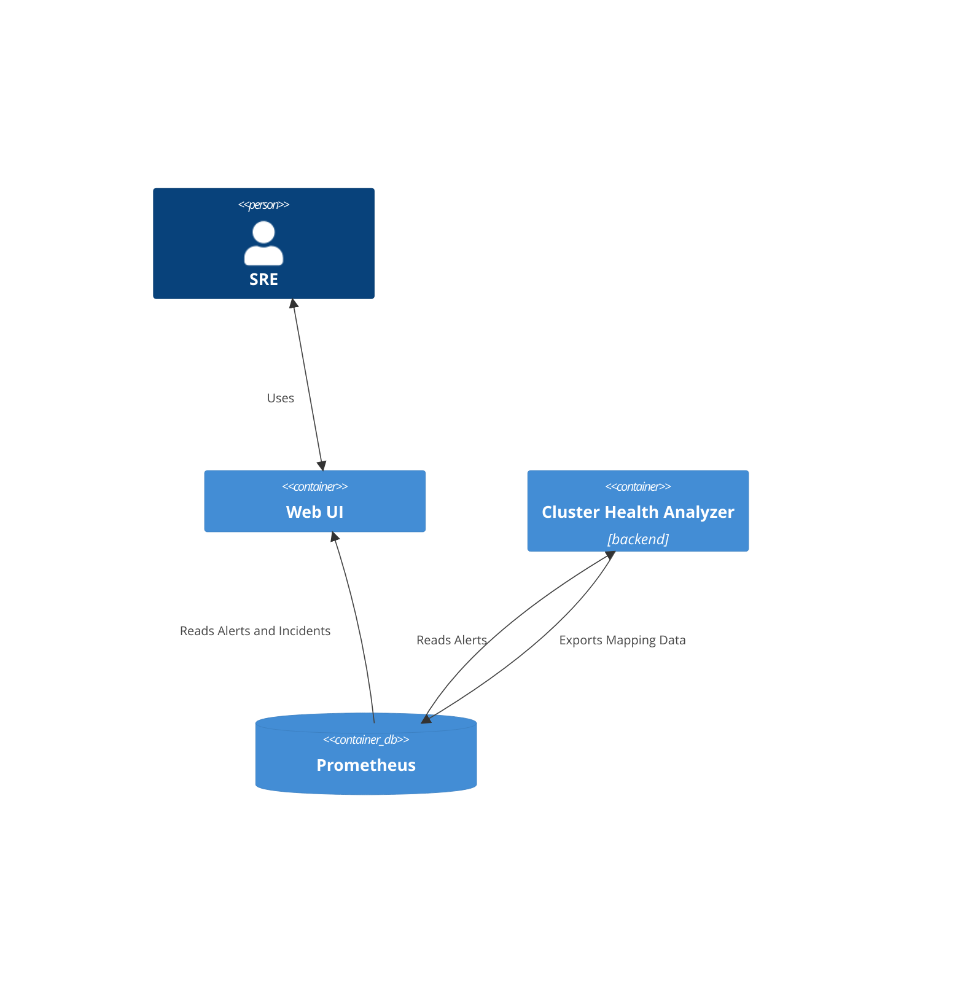

# Purpose

The goal of the health analyzer is to augment the underlying signal
about the OpenShift cluster health (alerts) and provide additional information to better
understand the impact on the overall health and relations between different parts
of the signal.

The feature it provides are:
- component mapping:  provides opinionated mapping between underlying alerts
and higher level components and ranking of the components.
- incident detection: mapping the incoming alerts into a higher-level concept: an incident. 
The purpose of the incidents to group together alerts that relate to the same underlying
issue.

# Architecture

At the core of the Cluster health analyzer is Prometheus as a time-series database.
It's used to read underlying observability data, as well as expose the analyzer
results for the user.



# Data model

The results of the analyzer are provided though a set of metrics:

## cluster:health:components

Provides basic information about the components.

```
cluster:health:components{component="authentication", layer="core"} 50
cluster:health:components{component="cert-manager", layer="core"}   55
```

The main purposes are:

- **Ranking of the components**: The value of the metric provides the level of
importance of the component from the overall cluster health perspective. The
lower the number, the more the important the component is.

- **List of available components [FUTURE]**: In certain views, we would like to
be able to include healthy components as well.  It's not implemented right now,
but in the future, we could limit the list of components only to those
applicable for particular cluster (right now, the analyzer exposes all the
components the analyzer is aware of, even the ones not relevant to the cluster.)

The anatomy:

```
cluster:health:components{
    // The layer the component belongs to.
    // Currently one of ["compute", "cluster", "workload"].
    layer="core",

    // The name of the component.
    component="etcd" 

} 50 // The ranking of the component. The more important, the lower value.
```

## cluster:health:components:map

Provides mapping between:
- source signal, e.g. alerts
- component
- incident
- normalized severity

The anatomy:
```
cluster:health:components:map{
   // Type of the source signal (currently only `alert`,
   // in the future it could be `cluster-operator-condition` etc.)
   type="alert",
                       
   // List of labels to identify the source. They should be specific enough
   // to match the specific component and incident. However, multiple metrics
   // can satisfy the labels: it's ok as soon as matching alerts have the same 
   // mapping.
   src_alertname="EtcdHighCommitDurations",
   src_namespace="etcd",
   src_severity="warning",

   // Identification of the component and layer the signal belongs to.
   component="core",
   layer="etcd",

   // Identification of the incident the signal has been assigned to.
   group_id="11f5125c-8e63-46c3-8576-4bb142a39fa9",
} 1 // The value represents the normalized value for the severity.
```

### The normalized severity value
In order to unify different indicators for severity of the signal, we map
the source to the integer values, that are exported as values of the metric.

The reason for introducing this values are:
- normalizing between different values provided in `severity` label: While
most of the alerts use one of `info`, `warning`, `critical`, in real world
other values are being used as well.
- normalizing across different type of signal [FUTURE]: e.g.
cluster-operator-conditions don't provide information about severity.

Being able to rely on a single number with a limited set of values makes it
easier to represent the severity to the user.

The meaning of the values is:
- 0 - healthy, mapping to "info" severity.
- 1 - warning, mapping to "warning" severity. The signal is related to the
health of the component, but not necessary requires immediate action. This is
the default values for arbitrary severity values.
- 2 - critical, mapping to "critical" severity.
