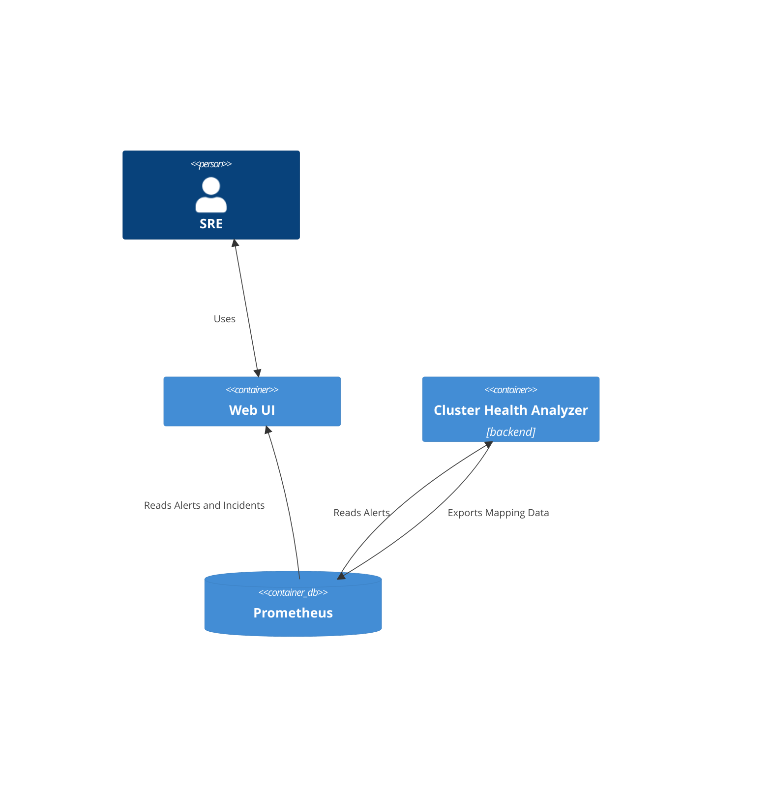

# Purpose

The goal of the Cluster Health Analyzer is to augment the underlying signal
about the OpenShift cluster health (alerts) and provide additional information to better
understand the impact on the overall health and the relationships between different parts
of the signal.

The feature it provides are:
- **component mapping**:  provides opinionated mapping between underlying alerts
and higher level components and ranking of the components.
- **incident detection**: maps the incoming alerts to a higher level concept: an incident. 
The purpose of incidents is to group alerts that are related to the same underlying 
issue.

# Architecture

The Cluster Health Analyzer uses Prometheus as a time-series database, to read the underlying 
observability data and present the analysis to the user.



# Data model

The results of the analyzer are provided through a set of metrics:

## cluster_health_components

Provides basic information about the components.

```
cluster_health_components{component="authentication", layer="core"} 50
cluster_health_components{component="cert-manager", layer="core"}   55
```

The main purposes are:

- **Ranking of the components**: The value of the metric indicates the level of
importance of the component from the perspective of overall cluster health. The
lower the number, the more the important the component is.

- **List of available components [FUTURE]**: In certain views, we would like to
be able to include healthy components as well. It's not implemented yet,
but in the future, we could limit the list of components to only those
that are relevant for a particular cluster (currently the analyzer exposes all the
components the analyzer is aware of, even thise that are not relevant for the cluster).

The anatomy:

```
cluster_health_components{
    // The layer the component belongs to. See the section below.
    layer="core",

    // The name of the component.
    component="etcd" 

} 50 // The ranking of the component. The more important, the lower value.
```

### The `layer` field

The layer can be used for high-level categorization of the components.

Currently we define the following layer values:

- `compute` - related to the health of the underlying nodes. Currently,
only one component named `compute` is assigned there. In the future,
each node (both control plane and worker) could be modeled as in individual
component. However, this would rtequire a reliable mechanism to extract the 
node name from the alert metadata.

- `core` - mostly components tied to the CVO operators. These components are
needed for the overall health of the cluster.

- `workload` - components tied to the workloads. This can mean alerts related
to the workloads directly, but also layered components installed via OLM.
They differ from the `core` operators in that they are not required to keep 
the cluster functioning, but rather extend it to provide additional functionality.

## cluster_health_components_map

Provides mapping between:
- source signal, e.g. alerts
- component
- incident
- normalized severity

The anatomy:
```
cluster_health_components_map{
   // Type of the source signal (currently only `alert`,
   // in the future it could be `cluster-operator-condition` etc.)
   type="alert",
                       
   // List of labels to identify the source. They should be specific enough
   // to match the specific component and incident. However, multiple metrics
   // can satisfy the labels: it's ok as soon as matching alerts have the same 
   // mapping.
   src_alertname="EtcdHighCommitDurations",
   src_namespace="etcd",
   src_severity="warning",

   // Identification of the component and layer the signal belongs to.
   component="core",
   layer="etcd",

   // Identification of the incident the signal has been assigned to.
   group_id="11f5125c-8e63-46c3-8576-4bb142a39fa9",
} 1 // The value represents the normalized value for the severity.
```

### The normalized severity value
To unify different indicators of signal severity, we map the source to the integer values that are exported as values of the metric.

The reasons for introducing these values are:

- normalization between different values provided in the `severity` label: While
most of the alerts use one of `info`, `warning`, `critical`, in the real world
other values are also used.
- normalization across different types of signals [FUTURE]: e.g.
cluster-operator-conditions don't provide information about severity.

Being able to rely on a single number with a limited set of values makes it
easier to present the severity to the user.

The meaning of the values is:
- `0` - healthy, mapping to "info" severity.
- `1` - warning, mapping to "warning" severity. The signal is related to the
health of the component, but doesn not require immediate action. This is
the default value for arbitrary severity values.
- `2` - critical, mapping to "critical" severity.
